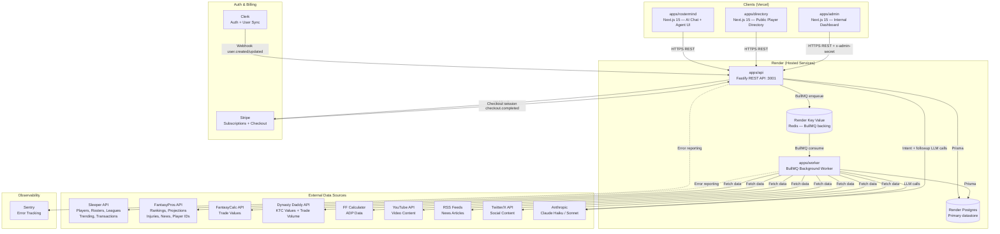
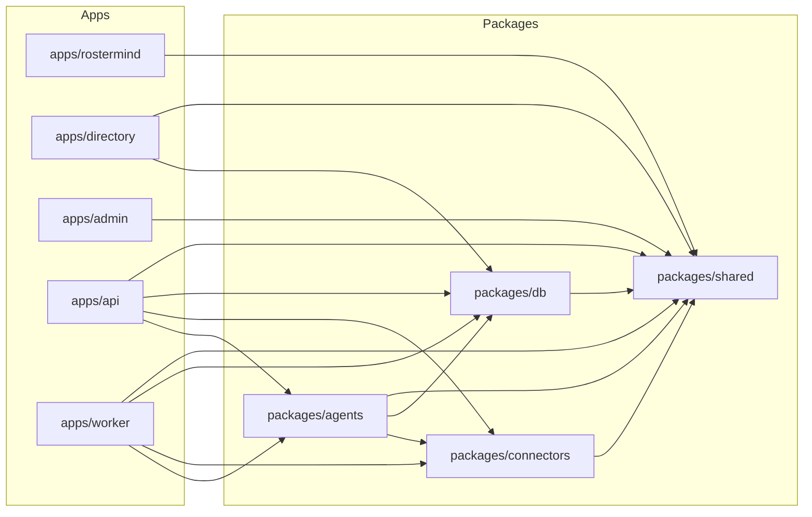
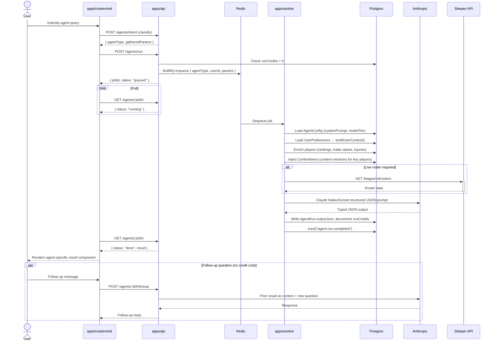
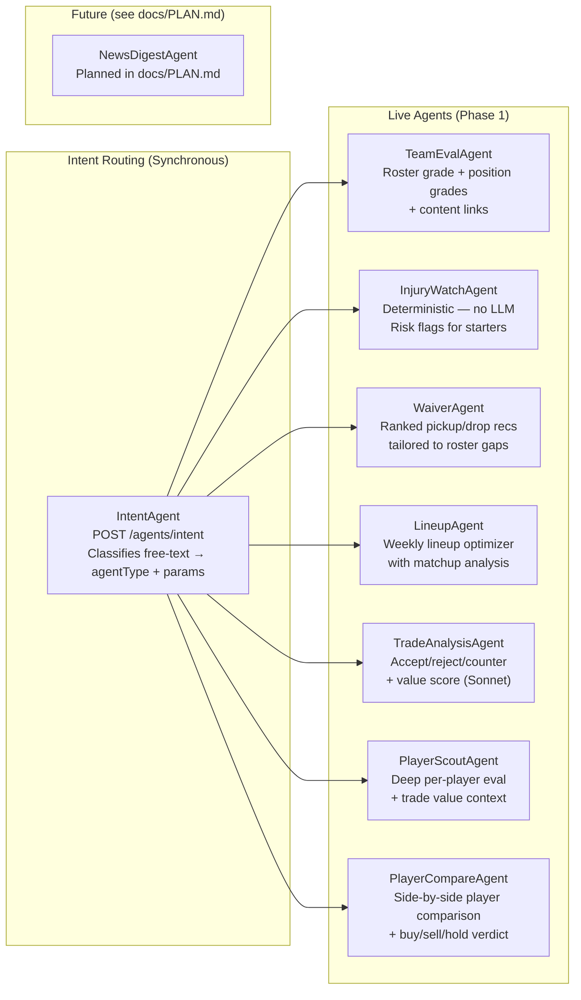
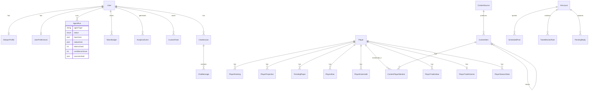

# Architecture

> Last updated: 2026-03-26
> Source of truth for system structure. Update this file whenever apps, packages, routes, agents, ingestion jobs, or DB models change.
> Planning/roadmap items live in `docs/PLAN.md`.

---

## 1. System Overview

---

## 2. Monorepo Package Graph

---

## 3. Agent Execution Flow

---

## 4. Data Ingestion Pipeline

```mermaid
graph TD
    SCHED["Scheduler\n(Worker startup — BullMQ cron)"]

    SCHED -->|Daily 6am ET| PR["PlayerRefreshJob\nSleeper /players/nfl"]
    SCHED -->|Every 30 min| IR["InjuryRefreshJob\nSleeper injury statuses"]
    SCHED -->|Hourly| TR["TrendingRefreshJob\nSleeper trending add/drop"]
    SCHED -->|Every 30 min| CR["ContentRefreshJob\nRSS feeds → articles"]
    SCHED -->|Every 2h| RED["RedditRefreshJob\n+ on-demand RedditBackfillJob"]
    SCHED -->|Every 2 hours| YR["YouTubeRefreshJob\nYouTube channel videos"]
    SCHED -->|Every 6 hours| FPN["FP News RefreshJob\nFantasyPros news + blurbs"]
    SCHED -->|Every 12 hours| FPI["FP Injuries RefreshJob\nFantasyPros injury probability"]
    SCHED -->|Daily 8am ET| TRX["TradeRefreshJob\nSleeper league transactions"]
    SCHED -->|Tue 9am ET| RR["RankingsRefreshJob\nSleeper searchRank proxy"]
    SCHED -->|Tue 9am ET| FPS["FP Player ID Sync\nFantasyPros player ID mappings"]
    SCHED -->|Tue+Fri 2:30pm UTC| ESR["ESPN Rankings RefreshJob\nPlayerRanking espn"]
    SCHED -->|Tue+Fri 2:45pm UTC| YAR["Yahoo Rankings RefreshJob\nPlayerRanking yahoo"]
    SCHED -->|Tue+Fri 9am ET| FPR["FP Rankings RefreshJob\nECR tiers, ownership, per-format"]
    SCHED -->|Tue+Fri 10am ET| FPP["FP Projections RefreshJob\nWeekly + ROS projected pts"]
    SCHED -->|Tue 10:30am ET| ADP["ADPRefreshJob\nFantasy Football Calculator ADP"]
    SCHED -->|Tue 10am ET| TVC["TradeValuesRefreshJob\nFantasyCalc dynasty/redraft values"]
    SCHED -->|Tue 11am ET| DDR["DynastyDaddyRefreshJob\nKTC + DD trade values + volume"]
    SCHED -->|Monthly 1st| CRF["CreditsRefillJob\nReset paid users to 50 credits"]

    PR --> Player["Player\nPlayerAlias\nPlayerExternalId"]
    IR --> Player
    TR --> TrendingPlayer["TrendingPlayer"]
    CR --> Content["ContentItem\nContentPlayerMention\nContentSource"]
    RED --> Content
    YR --> Content
    FPN --> Content
    FPI --> Player
    TRX --> TradeTransaction["TradeTransaction"]
    RR --> PlayerRanking["PlayerRanking"]
    FPS --> PlayerExternalId["PlayerExternalId"]
    ESR --> PlayerRanking
    YAR --> PlayerRanking
    FPR --> PlayerRanking
    FPP --> PlayerProjection["PlayerProjection"]
    ADP --> PlayerRanking
    TVC --> PlayerTradeValue["PlayerTradeValue\nsource=fantasycalc"]
    DDR --> PlayerTradeValue2["PlayerTradeValue\nsource=ktc / dynastydaddy\nPlayerTradeVolume"]
    CRF --> User["User.runCredits"]
```

**Operator surface:** `packages/shared/src/ingestion-registry.ts` (`INGESTION_JOB_REGISTRY`) is the single source of truth for every `IngestionJobType`: labels, schedules, and which jobs register BullMQ repeat schedulers. On startup the worker calls `assertIngestionRegistryComplete()` then registers cron from `INGESTION_SCHEDULED_JOB_ENTRIES`. Admin’s `INGESTION_JOB_CATALOG` is derived from the same registry (not hand-maintained). `POST /internal/ingestion/trigger` accepts any `IngestionJobType` from `@rzf/shared` (same allowlist as the worker). Each ingestion execution writes a row to `IngestionJobRun` (audit); Admin **Queue → Ingestion** lists BullMQ jobs and paginates DB runs with **Retry**. **On-demand** jobs (e.g. `reddit_backfill`, `season_stats_refresh`) have no repeat scheduler — trigger via API or Admin. Directory home feed uses cursor pagination (`/api/feed`) with client “Load more”; player profiles paginate mentions via `/api/players/[id]/mentions`.

---

## 5. Agent Roster

---

## 6. Key Database Models

---

## 7. Deployment

| Service | Platform | Plan | Cost |
|---------|----------|------|------|
| `apps/rostermind` | Vercel | Free | $0 |
| `apps/directory` | Vercel | Free | $0 |
| `apps/admin` | Vercel | Free | $0 |
| `apps/api` | Render Web Service | Starter | $7/mo |
| `apps/worker` | Render Background Worker | Starter | $7/mo |
| Postgres | Render Managed Postgres | Starter | $7/mo |
| Redis | Render Key Value | Starter | $10/mo |
| **Total** | | | **$31/mo** |

### Directory app API routes (Next.js Route Handlers)

Authenticated custom feeds (Clerk): `GET`/`POST` `/api/custom-feeds`, `PATCH`/`DELETE` `/api/custom-feeds/[id]`, `GET` `/api/custom-feeds/[id]/items` (cursor pagination). Trending topic chips use server-side aggregation + `unstable_cache` on the home page (`getTrendingTopics`).

---

## 8. Security Notes

- All secrets validated at startup via Zod (`packages/shared/src/env.ts`) — no raw `process.env` access
- Clerk JWTs verified on all protected API routes
- Admin routes (`/internal/*`) require `User.role === "admin"` checked server-side
- Admin dashboard (`apps/admin`) uses `ADMIN_SECRET` header — no Clerk dependency
- Stripe webhook signatures verified via Svix before processing
- Clerk webhook signatures verified via Svix before processing
